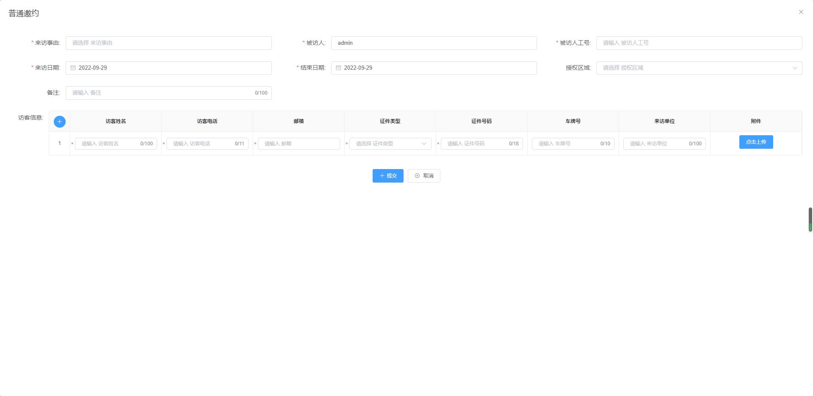

  

# 智慧园区出入口综合管理平台
- 实现企业对园区出入口以及重要卡口的综合管理，包括人行、车行相关硬件设备，以及通行产生的流水，并提供基于出入口的安全保障功能，系统提供完善的组织架构体系，适合人、车日流量10W左右的型企业使用
- 平台覆盖了流程管理、用户管理、园区管理、访客管理、停车管理、设备设施、运维管理、安全保障、数据大屏、日志管理、系统管理等多个模块
- 平台采用多租户架构，权限系统完善，接口权限以及数据权限均可配、还可自定义
- 平台功能完全开放使用，智能网关源代码开源（11月发布）

## 官方网站
[https://www.qlhxcloud.cn](https://www.qlhxcloud.cn)

## 系统Demo
- [Demo] 平台应用定期发布
- [Demo] 使用智能网关控制自己的硬件设备
- [Demo] [http://ego.qlhxcloud.cn/](http://ego.qlhxcloud.cn/)
- [Demo] 开放演示租户，租户ID：771877，用户名：admin，密码ego@2022

## 版本兼容性
- 操作系统支持：centos7、centos8、ubuntu18.04
- 平台版本v2.9.0
- 智能网关版本v1.6
## 主要技术栈
### 后端技术栈
- 平台框架：BladeX2.8.2
- 智能网关：开发框架SpringBoot 2.3.12
- 日志管理:Logback 1.2.3
- 流程引擎:Flowable6.4.2
- 任务调度:XXL-JOB2.3.1
- 项目管理框架: Maven 3.6
- 持久层框架:Mybatis3.4.2
- 采用Oauth2协议进行统一的Token下发与鉴权，保证系统安全性
- Api框架Swagger
- 文件服务：Minio Version: go1.15.7

### 前端技术栈
- Avue2.3.x
### 开发环境
- IDE:IntelliJ IDEA 2020.2以上
- JDK:JDK 1.8
- 数据库:Mysql8
- Redis:6.2.5
- RabbitMQ:3.8.8

### 软件架构

## 智能网关
### 与平台交互
- 智能网关与E-GO平台之间，通过rabbitmq进行数据交互，具体交互流程是这样的： 
	1. E-GO平台添加好的设备，通过平台智能网关模块下发到网关（MQ设备初始化队列）进行初始化，下发的信息包括设备的sn编号、设备名称、设备参数、设备能力等；
	2. 智能网关接收到平台的设备初始化数据后，按照平台要求，完成初始化工作，开启各类设备的能力；
	3. 平台需要使用设备时（人员的设备权限下发或设备远程控制等交互事件），通过统一调用配置，并携带特殊参数，发送到MQ，网关订阅MQ消息，并执行平台要求的事件。
- 由于车牌识别设备的对接SDK限制，目前在使用车牌识别的场景下，仅支持windows环境的部署；如不使用车牌，可在Linux环境（ubuntu、centos）下部署。

### 控制参数说明
	{
	    "cmd": "ADD",                        // 命令类型
	    "eventId": "1574662261179277313",    // 平台发送的事件ID
	    "eventType": 1,                      // 事件类型
	    "sn": "213106100",                   // 设备的SN号
	    "authData": {                        // 交互数据参数
	        "cardNum": "77889922",           // 卡号
	        "endTime": "2029-12-31 00:00:00",// 授权结束时间  
	        "userName": "张三",              // 用户名
	        "startTime": "2022-02-18 11:15:00",  // 授权起始时间
	        "personType": "1"                    // 用户类型，回调时原样返回
	    }
	}

- cmd的参数 
---

	public class GatewayCmdContant {
		/**
		 * 新增
		 */
		public static final String ADD = "ADD";
		/**
		 * 删除
		 */
		public static final String DELETE = "DELETE";
		/**
		 * 更新
		 */
		public static final String UPDATE = "UPDATE";
		/**
		 * 批量授权
		 */
		public static final String ADD_BATCH = "ADD-BATCH";
		/**
		 * 新增或者更新
		 */
		public static final String ADD_OR_UPDATE = "ADD-OR-UPDATE";
		/**
		 * 查找
		 */
		public static final String FIND = "FIND";
		/**
		 * 重启
		 */
		public static final String REBOOT = "REBOOT";
	
		/**
		 * 关机
		 */
		public static final String SHUTDOWN = "SHUTDOWN";
	
		/**
		 * 清空权限
		 */
		public static final String CLEAR_ALL = "CLEAR-ALL";
	
		/**
		 * 远程关门
		 */
		public static final String CLOSE_DOOR = "CLOSE-DOOR";
		/**
		 * 远程开门
		 */
		public static final String OPEN_DOOR = "OPEN-DOOR";
		/**
		 * 初始化
		 */
		public static final String INITIALIZING = "INITIALIZING";
	
		/**
		 * 网页后台点击事件
		 */
		public static final String DEVICE_WEB_CKICK_EVENT = "DEVICE-WEB-CKICK-EVENT";
	
		/**
		 * 删除用户所有权限
		 */
		public static final String DELETE_USER_ALL_DEVICE = "DELETE-USER-ALL-DEVICE";
	
		/**
		 * 添加黑名单
		 */
		public static final String ADD_BLACK = "ADD-BLACK";
		/**
		 * 删除黑名单
		 */
		public static final String REMOVE_BLACK = "REMOVE-BLACK";
	}
- authData为授权数据，比如给人脸机下发数据，这里需要包含人脸照片、授权起始和结束时间、人员姓名（人脸机任命提示）等信息
	1. 卡片类包含参数：cardNum（卡号）、userName（姓名）、doorNum(梯控类，楼层授权、梯控必填)、startTime（授权起始时间）、endTime（授权结束时间）、personType（人员类型-按平台）
	2. 人脸类：人脸类授权包含了卡片了全部参数，额外增加了imgUrl（人脸图片地址）、faceId（人脸ID），人脸设备的使用，目前采用的图片地址，暂未扩展base64格式图片。
	3. 车牌识别类：carNum（车牌号）、startTime（授权起始时间）、endTime（授权结束时间）
### 网关二次开发的说明
设备的扩展在org.springblade.modules.iot.adapt.driver路径下，使用时集成BaseDeviceAdapt适配器类，完成设备的基础功能封装，具体实现可参考driver下各个设备代码的实现。如在对接设备时，平台参数authData不满足，请将使用的设备以及需要实现的功能告诉我们，参考设备对接价值后，我们可升级平台，以支持更多功能的扩展。

### 智能网关可视化界面

## 功能清单

## 开源协议补充申明
- 智慧园区出入口综合管理平台之智能网关开源免费(协议:MIT)，并且将持续提供免费的社区技术支持，个人或企业内部可自由的接入和使用，但禁止任何单位或个人修改软件后再次发行或出售的行为
- 智能网关源代码即将开源，软件介质以社区版形式供免费使用,在未授权情况下，禁止修改涉及版权信息的相关代码和名称
## 部署说明
### 多租户部署结构图

### 单租户部署结构图

### 部署方式
#### Windows部署
##### 部署所需
- Java环境
- Mysql数据库
- Rabbitmq服务
- Redis服务
- Minio服务
##### 部署步骤
1. 安装好所需服务以及AlwaysUp。
2. 工程目录下执行 mvn clean package 获取打包后的 jar 。
3. 编写windows启动脚本
4. 拷贝至部署的文件夹中
5. 打开AlwaysUp增加脚本
6. 先启动 ConfigServer 服务，再依次启动其他服务

#### Linux部署
##### jar包部署
###### 部署所需
- Java环境
- Mysql数据库
- Rabbitmq服务
- Redis服务
- Minio服务
###### 部署步骤
1. 工程目录下执行 mvn clean package 获取打包后的 jar 。
2. 编写启动脚本（可参考 /script/service.sh ） 

3. 将jar包与脚本通过FTP拷贝至服务器，并给其设置执行权限，也可通过命令行执行:chmod 744 service.sh
4. 进入对应目录依次执行脚本 ./service.sh start 即可

##### docker部署
###### 部署所需
- Java环境
- Mysql数据库
- Rabbitmq服务
- Redis服务
- Minio服务
- Docker环境
###### 部署步骤
- 请自行搜索在Docker中部署运行jar

## 系统示例页面

